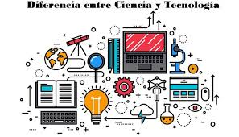
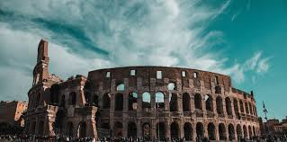
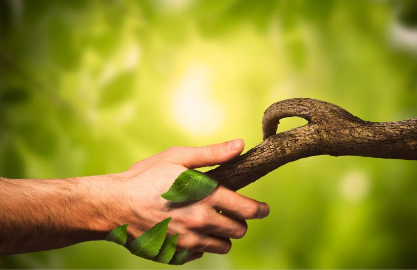

# Viaja&Aprende

---

## Menú de Navegación
- [Inicio](#)
- [Novedades](#)
- [Contactos](#)
- [Shop](#)
- 

---

## Video de Presentación y Carrusel de Imágenes

### Video

### Carrusel de Imágenes
1. 
2. 
3. 

---

## Nuestros Planes

### Inmersión en el Idioma Local

Estancias en países donde se habla inglés, francés, alemán, u otros idiomas. Los estudiantes asisten a clases en una escuela local y se alojan con familias anfitrionas.

### Experiencia Profesional Internacional

Pasantías en empresas en el extranjero, enfocadas en estudiantes de áreas como negocios, tecnología y turismo.

### Campamentos de Ciencia y Tecnología

Viajes a ciudades tecnológicas como Silicon Valley para talleres intensivos en programación, IA y biotecnología.

### Voluntariado y Desarrollo Social

Programas en países en desarrollo para apoyar a comunidades locales en áreas como educación y sostenibilidad.

### Tour de Historia y Cultura Global

Visitas a museos y monumentos en ciudades históricas del mundo.

### Exploración Ambiental y Conservación

Viajes a regiones biodiversas como la Amazonía para proyectos de conservación.

### Diplomacia y Relaciones Internacionales

Programas en ciudades clave, como Nueva York, para interactuar con diplomáticos y organizaciones internacionales.

### Arte y Cultura en el Extranjero

Viajes a capitales artísticas como París, Londres o Roma para aprender sobre arte clásico y contemporáneo.

### Salud y Bienestar en la Naturaleza

Programas de bienestar en destinos rodeados de naturaleza, con actividades de yoga y meditación.

---

## Formulario de Contacto

**Te llamamos**

- **Nombre**: [_________]
- **Correo Electrónico**: [_________]
- **Mensaje**:  
    [____________________]

**Enviar**

---

## Síguenos en Redes Sociales

- [WhatsApp](https://wa.me/)
- [Instagram](https://www.instagram.com/)
- [Facebook](https://www.facebook.com/)

---

© 2024 Viaja&Aprende. Todos los derechos reservados.
